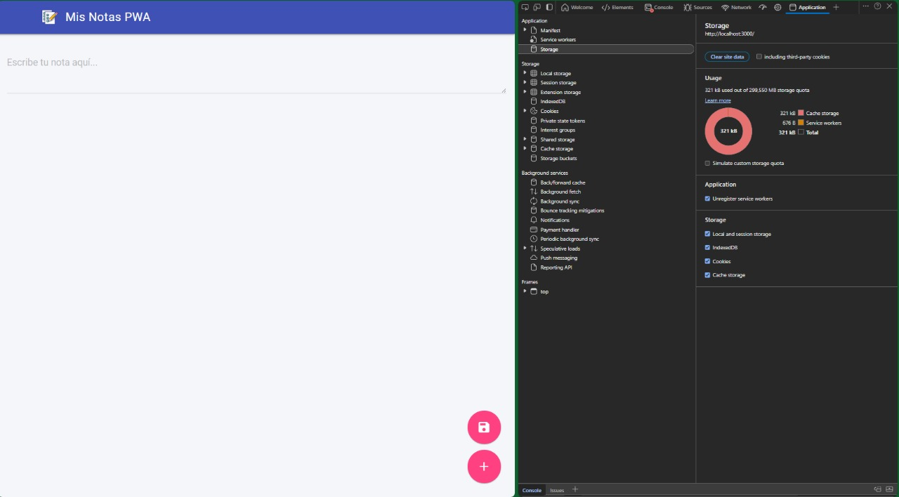
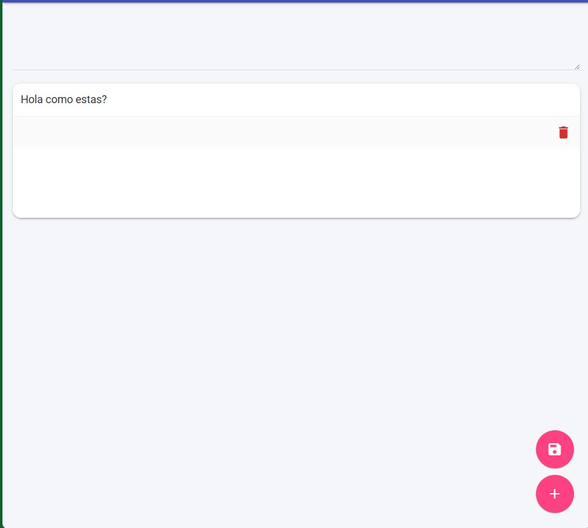
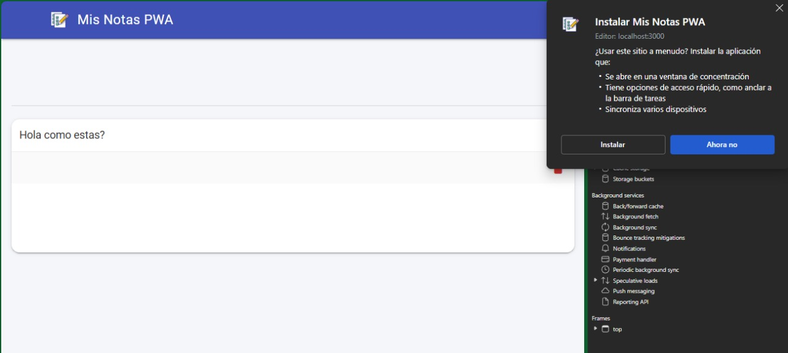
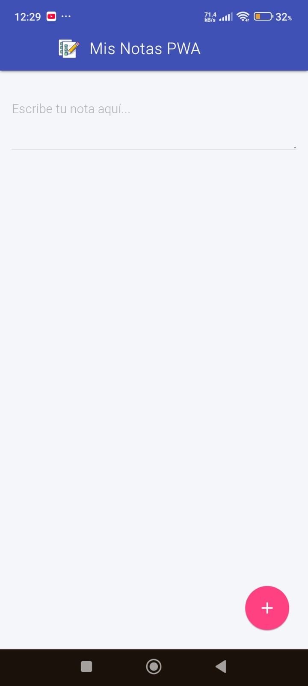

# Mis Notas PWA

## Descripción

**Mis Notas PWA** es una aplicación web progresiva (PWA) que permite crear, visualizar y eliminar notas de manera sencilla y rápida. Está diseñada para funcionar tanto en navegadores modernos como en dispositivos móviles, permitiendo su instalación como aplicación nativa (APK) gracias al soporte de PWA. La interfaz utiliza **Material Design Lite (MDL)** para un diseño limpio y moderno, incluyendo botones flotantes, tarjetas de notas y un botón de instalación.

---

## Funcionalidades

- **Crear notas:** Escribe tus notas en el textarea y presiona el botón flotante para guardarlas.  
- **Visualizar notas:** Todas las notas se muestran en tarjetas estilizadas que puedes ver en el contenedor principal.  
- **Eliminar notas:** Cada tarjeta incluye un botón de eliminar para borrar notas individualmente.  
- **Instalación como PWA:** Un botón flotante permite instalar la aplicación en dispositivos móviles y escritorios compatibles.  
- **Almacenamiento local:** Las notas se guardan en `localStorage`, por lo que se mantienen aunque cierres el navegador.  
- **Modo offline:** Gracias al service worker, la aplicación puede funcionar sin conexión a internet.

---

## Estructura del proyecto
```bash
notas-pwa/
│
├─ index.html 
├─ style.css 
├─ app.js 
├─ manifest.json 
├─ sw.js 
└─ assets/
    └─ icons/
        └─ icon-192.png 
        └─ icon-512.png 
├─ package-lock.json 
├─ package.js 
```

---

## Tecnologías utilizadas

- **HTML5** y **CSS3**  
- **JavaScript** para la lógica de la aplicación y manejo del Service Worker  
- **Material Design Lite (MDL)** para componentes UI (botones, tarjetas, layout)  
- **PWA** con `manifest.json` y `Service Worker` para funcionalidad offline e instalación  

---

## Cómo usar

1. Clonar o descargar el repositorio.  
```bash
git clone https://github.com/JordanGuevara/lab-notas-pwa.git
cd notas-pwa
```
2. Abrir `index.html`. 
3. Escribir una nota en el área de texto y presionar el botón **+** (FAB).  
4. Se verá las notas aparecer en tarjetas debajo del formulario.  
5. Para eliminar una nota, presionar lo que es el ícono de **borrar** en la tarjeta correspondiente (simbolo de basura).  
6. En el botón de agrear también estará el de **Instalar App** flotante; hacer clic para instalar la aplicación en tu dispositivo.  

---

## Instalación

Para probar localmente con soporte de PWA y cache offline, se recomienda usar un servidor local, por ejemplo con **lite-server**:

```bash
npm install
npm start
```
Esto lanzará la aplicación en http://localhost:3000 y podrás probar la instalación y funcionamiento offline.

## Link de la pagina de funcionamiento

Aqui se puede observar lo que es la pagina en funcionamiento https://jordanguevara.github.io/lab-notas-pwa/

## Capturas de funcionamiento

Funcionamiento del proyecto desde la ejecución local.



El ingreso de notas dentro del index y con sus botones.



Demostración de que se puede descargar apk y en celular


